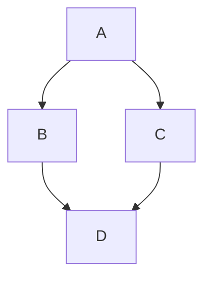

# testing mermaid

## Sample diagram



Code block for above diagram:
```
graph TD;
    A-->B;
    A-->C;
    B-->D;
    C-->D;
```

## Refs and Notes

https://github.blog/developer-skills/github/include-diagrams-markdown-files-mermaid/

https://mermaid.live - can edit and test code in live editor before inserting into doc.  

https://mermaid.js.org/intro/ - Mermaid documentation.

Paid version of mermaid with additional features at https://mermaid.ai
